# 🚫 Agent Anti-Patterns Visual Guide

> **Purpose**: A visual reference for LLMs to generate educational slides and infographics about common agent development mistakes.

## 📊 Executive Summary

**Total Failures Analyzed**: 5

| Category | Count | Impact Level |
|----------|-------|--------------|
| 🔀 📤 Output Format Mismatch | 2 | 🟢 Low |
| ⚠️ 🔤 String Matching Pitfalls | 2 | 🟢 Low |
| 📋 📝 Missing Documentation | 1 | 🟢 Low |

## 🗺️ Anti-Pattern Landscape

```mermaid
mindmap
  root((Agent\nAnti-Patterns))
    📤 Output Format Mismatch
      While your code implementation...
      Currently, the agent's 'reason...
    🔤 String Matching Pitfalls
      The current agent does not mai...
      It appears you have submitted ...
    📝 Missing Documentation
      using an EphemeralClient means...
```



---

## 🔀 📤 Output Format Mismatch

> Response formats that don't match downstream parser expectations

### 📈 Frequency Distribution

```
While your code implementation looks cor ██████████████████████████████ (1)
Currently, the agent's "reasoning" outpu ██████████████████████████████ (1)
```

### 🃏 Top Anti-Patterns

#### 1. Failure Reason

**Impact**: 🟢 1 students affected (Criterion 1)

**What went wrong**:
> While your code implementation looks correct, I noticed that the notebook cells have not been executed (the output cells are empty)

**Why this breaks the agent**:
> While your code implementation looks correct, I noticed that the notebook cells have not been executed (the output cells are empty). For a code review, we need to see the execution outputs to verify that the code actually runs and produces the expected results, especially for the semantic search dem

**✅ Correct Pattern**:
```yaml
# ✅ CORRECT: Match the exact expected format from rubric
OUTPUT_FORMAT:
  - Use "IS_COMPATIBLE" (not "COMPATIBLE")
  - Use "IS_INCOMPATIBLE" (not "INCOMPATIBLE")
  
EXAMPLES:
  - Input: "Outdoor hiking" + "Heavy Rain"
    Output: "IS_INCOMPATIBLE: Heavy rain makes trails dangerous"
```

**💡 Visual Metaphor**:
> Like speaking French to a Spanish parser - technically language, but nothing gets through.

---

#### 2. Failure Reason

**Impact**: 🟢 1 students affected (Criterion 4)

**What went wrong**:
> Currently, the agent's "reasoning" output is a hardcoded string (`f"The query asks for

**Why this breaks the agent**:
> Currently, the agent's "reasoning" output is a hardcoded string (`f"The query asks for... I will use..."`) rather than an actual thought trace generated by an LLM. For this criterion, we need to see the agent's *actual* decision-making process—showing how the LLM decided which tool to use based on t

**✅ Correct Pattern**:
```yaml
# ✅ CORRECT: Match the exact expected format from rubric
OUTPUT_FORMAT:
  - Use "IS_COMPATIBLE" (not "COMPATIBLE")
  - Use "IS_INCOMPATIBLE" (not "INCOMPATIBLE")
  
EXAMPLES:
  - Input: "Outdoor hiking" + "Heavy Rain"
    Output: "IS_INCOMPATIBLE: Heavy rain makes trails dangerous"
```

**💡 Visual Metaphor**:
> Like speaking French to a Spanish parser - technically language, but nothing gets through.

---

---

## ⚠️ 🔤 String Matching Pitfalls

> Logic errors where substring matching causes false positives/negatives

### 📈 Frequency Distribution

```
The current agent does not maintain memo ██████████████████████████████ (1)
It appears you have submitted the starte ██████████████████████████████ (1)
```

### 🃏 Top Anti-Patterns

#### 1. Failure Reason

**Impact**: 🟢 1 students affected (Criterion 3)

**What went wrong**:
> The current agent does not maintain memory of the conversation history, which is a requirement for this criterion

**Why this breaks the agent**:
> The current agent does not maintain memory of the conversation history, which is a requirement for this criterion. It processes each query in isolation. Additionally, the citation logic needs to be dynamically extracted from the retrieval tool's output, rather than just returning a placeholder or a 

**✅ Correct Pattern**:
```python
# ✅ CORRECT: Check for negative case first
if "INCOMPAT" in normalized_resp:
    is_compatible = False
elif "COMPAT" in normalized_resp:
    is_compatible = True

# ✅ BETTER: Use exact matching
if normalized_resp == "IS_COMPATIBLE":
    is_compatible = True
elif normalized_resp == "IS_INCOMPATIBLE":
    is_compatible = False
```

**💡 Visual Metaphor**:
> Like a bouncer checking IDs who lets in anyone whose name *contains* 'VIP' - including 'NOT_VIP'!

---

#### 2. Failure Reason

**Impact**: 🟢 1 students affected (Criterion 2)

**What went wrong**:
> It appears you have submitted the starter project without implementing the required `retrieve_game` and `evaluate_retrieval` tools

**Why this breaks the agent**:
> It appears you have submitted the starter project without implementing the required `retrieve_game` and `evaluate_retrieval` tools. These are essential for your agent to access the game data you prepared in Part 1 and to quality-check its own retrieval.

**✅ Correct Pattern**:
```python
# ✅ CORRECT: Check for negative case first
if "INCOMPAT" in normalized_resp:
    is_compatible = False
elif "COMPAT" in normalized_resp:
    is_compatible = True

# ✅ BETTER: Use exact matching
if normalized_resp == "IS_COMPATIBLE":
    is_compatible = True
elif normalized_resp == "IS_INCOMPATIBLE":
    is_compatible = False
```

**💡 Visual Metaphor**:
> Like a bouncer checking IDs who lets in anyone whose name *contains* 'VIP' - including 'NOT_VIP'!

---

---

## 📋 📝 Missing Documentation

> Tool docstrings lacking critical information for LLM understanding

### 📈 Frequency Distribution

```
using an EphemeralClient means your vect ██████████████████████████████ (1)
```

### 🃏 Top Anti-Patterns

#### 1. using an EphemeralClient means your vector databas

**Impact**: 🟢 1 students affected (Criterion 1)

**What went wrong**:
> using an EphemeralClient means your vector database won't persist between sessions. The project explicitly requires persistent storage so the RAG system can be reused.

**Why this breaks the agent**:
> Your submission is missing the required **Udaplay_01_solution_project.ipynb** notebook that should demonstrate the RAG pipeline setup with data loading, vector database creation, and semantic search capabilities. While your Udaplay_02 notebook shows you embedded some vector database code inline, thi...

**✅ Correct Pattern**:
```python
# ✅ CORRECT: Comprehensive docstring with format specification
def get_activities_by_date_tool(date: str, city: str) -> List[Activity]:
    """Retrieves available activities for a specific date and city.
    
    Args:
        date (str): Target date in YYYY-MM-DD format (e.g., "2025-06-12")
        city (str): City name (e.g., "AgentsVille")
    
    Returns:
        List[Activity]: Available activities matching criteria
    
    Example:
        >>> get_activities_by_date_tool("2025-06-12", "AgentsVille")
        [Activity(id="A001", name="Museum Tour", ...)]
    """
```

**💡 Visual Metaphor**:
> Like giving someone a map with no labels - they'll guess where to go and probably get lost.

---

## 🎨 Slide Generation Hints

When generating slides from this document:

1. **Title Slide**: Use the executive summary statistics
2. **Category Slides**: One slide per category with the mindmap subsection
3. **Deep Dive Slides**: Before/After code comparisons with visual metaphors
4. **Impact Slides**: Use frequency bars to show which issues are most common
5. **Takeaway Slide**: Summarize the top 3 anti-patterns to avoid

### Color Coding Reference

| Color | Meaning |
|-------|--------|
| 🔴 Red | Critical issue (>100 occurrences) |
| 🟡 Yellow | Moderate issue (20-100 occurrences) |
| 🟢 Green | Low frequency (<20 occurrences) |
