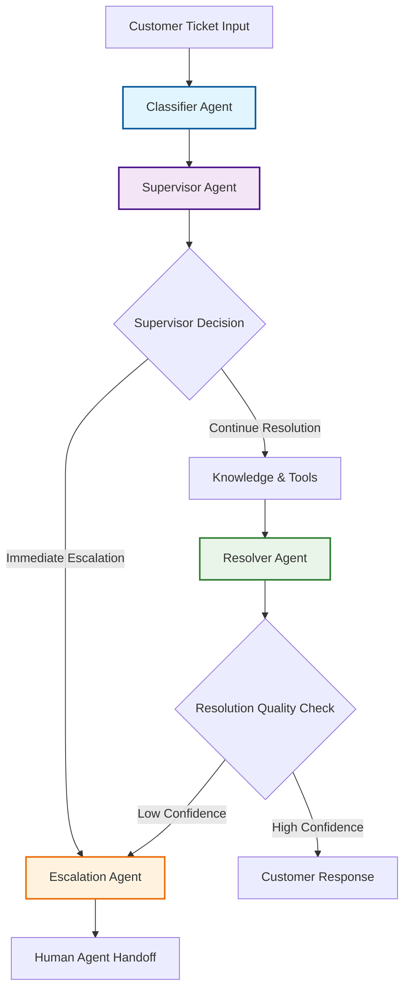
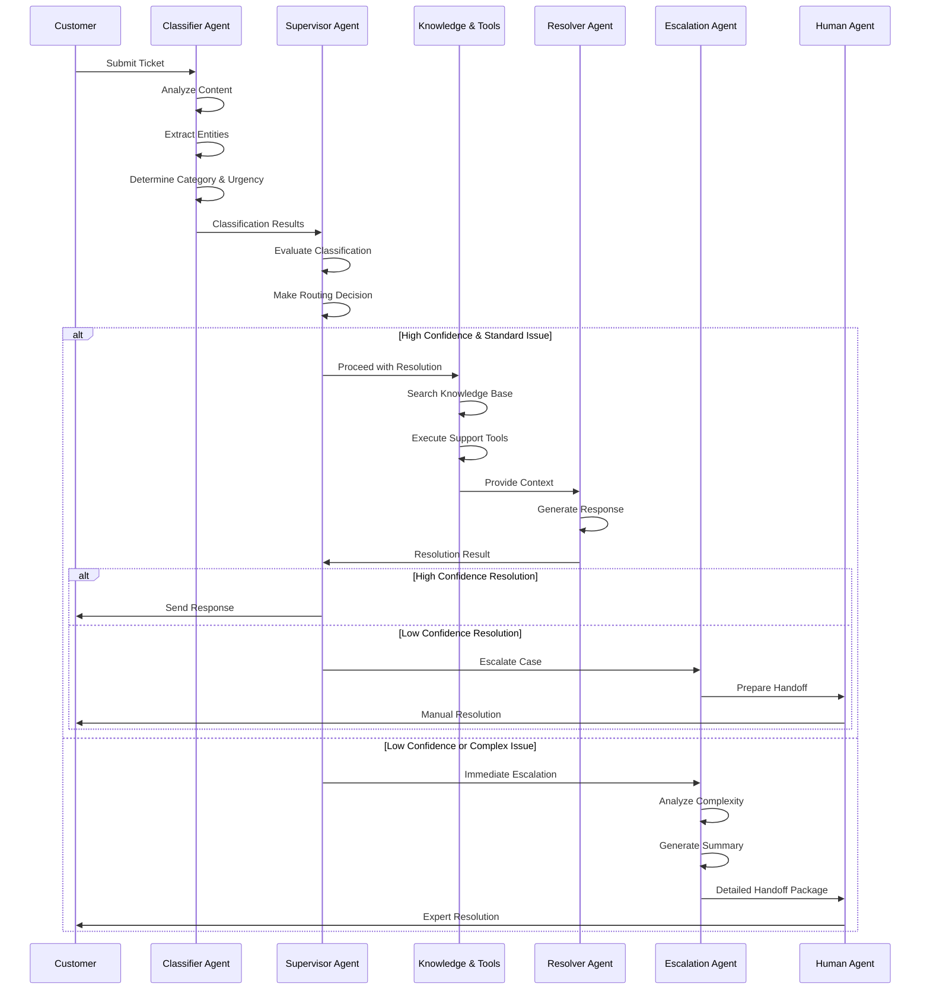
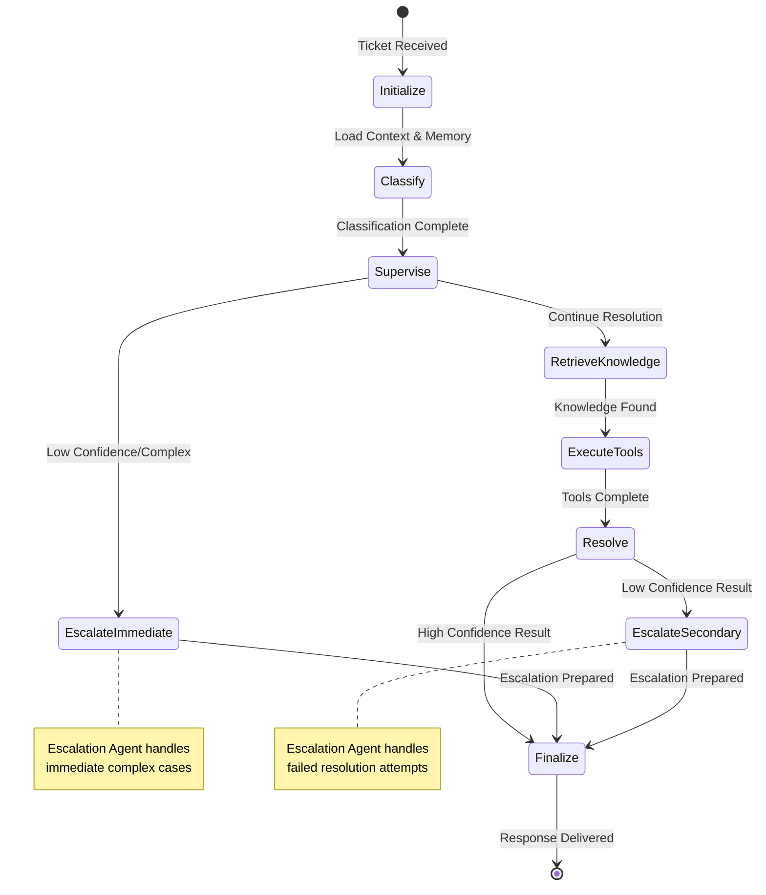
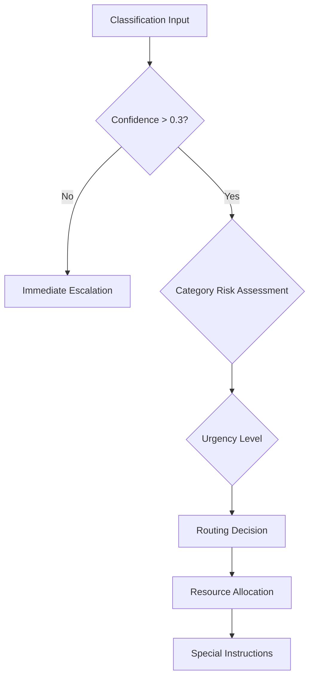

# UDA-Hub Multi-Agent System

This folder contains the four specialized agents that form the core of UDA-Hub's intelligent customer support automation system. Each agent has a specific role and responsibility within the supervisor-based multi-agent architecture.

## Agent Overview

| Agent | File | Role | Primary Responsibilities |
|-------|------|------|--------------------------|
| **Classifier** | `classifier_agent.py` | Ticket Analysis | Categorize tickets, extract entities, determine urgency |
| **Supervisor** | `supervisor_agent.py` | Workflow Coordination | Route tickets, make high-level decisions, monitor progress |
| **Resolver** | `resolver_agent.py` | Response Generation | Generate customer responses, synthesize information |
| **Escalation** | `escalation_agent.py` | Human Handoff | Handle complex cases, prepare escalation summaries |

## Multi-Agent Architecture Visualization

### High-Level Agent Interaction Flow



### Detailed Agent Workflow



### Agent State Management



## Individual Agent Details

### 1. Classifier Agent (`classifier_agent.py`)

**Purpose**: First point of analysis for incoming customer tickets.

**Core Functions**:
- `classify_ticket()` - Main classification logic
- `extract_entities()` - Extract customer info, emails, IDs
- `determine_urgency()` - Assess ticket priority
- `suggest_tools()` - Recommend appropriate tools

**Classification Categories**:
- LOGIN_ISSUE
- BILLING_PAYMENT  
- RESERVATION_BOOKING
- TECHNICAL_ISSUE
- ACCOUNT_MANAGEMENT
- GENERAL_INQUIRY
- ESCALATION_REQUIRED

**Output Structure**:
```json
{
  "category": "BILLING_PAYMENT",
  "confidence": 0.85,
  "urgency": "medium",
  "key_entities": {
    "user_email": "customer@email.com",
    "amount": "$29.99"
  },
  "suggested_tools": ["lookup_user_account", "billing_inquiry"],
  "escalate": false
}
```

### 2. Supervisor Agent (`supervisor_agent.py`)

**Purpose**: Central coordinator that makes high-level workflow decisions.

**Core Functions**:
- `coordinate_workflow()` - Main coordination logic
- `monitor_progress()` - Track workflow execution
- `make_final_decision()` - Resolution vs escalation decisions

**Decision Points**:
1. **Post-Classification**: Continue or immediate escalation?
2. **Progress Monitoring**: Intervention needed?
3. **Final Decision**: Accept resolution or escalate?

**Coordination Logic**:


### 3. Resolver Agent (`resolver_agent.py`)

**Purpose**: Synthesizes information and generates customer-facing responses.

**Core Functions**:
- `generate_response()` - Create customer responses
- `generate_escalation_summary()` - Prepare escalation details
- `assess_resolution_confidence()` - Quality assessment

**Response Generation Process**:
1. Analyze classification and context
2. Incorporate knowledge base results
3. Include tool execution outcomes
4. Generate personalized response
5. Assess confidence and escalation needs

**Quality Metrics**:
- Response completeness
- Information accuracy
- Customer tone appropriateness
- Resolution confidence score

### 4. Escalation Agent (`escalation_agent.py`)

**Purpose**: Handles complex cases requiring human intervention.

**Core Functions**:
- `process_escalation()` - Main escalation logic
- `_analyze_escalation()` - Root cause analysis
- `_create_handoff_package()` - Human agent preparation

**Escalation Categories**:
- **Low Confidence**: Uncertain classification/resolution
- **Complexity**: Multi-step or technical issues
- **Billing Dispute**: Financial conflicts
- **Technical Complexity**: System/app issues
- **Account Security**: Security-related concerns

**Handoff Package Structure**:
```json
{
  "ticket_summary": {...},
  "escalation_details": {
    "priority": "P1/P2/P3",
    "estimated_resolution_time": "1-2 hours",
    "customer_impact": "high/medium/low"
  },
  "recommended_actions": [...],
  "required_expertise": ["billing_specialist", "technical_support"],
  "context": {...}
}
```

## Agent Communication Patterns

### Message Passing
- **Input**: Structured dictionaries with ticket data
- **Processing**: Agent-specific analysis and transformation
- **Output**: Standardized result formats for next agent

### Shared State Management
All agents access and modify the `EnhancedAgentState`:

```python
class EnhancedAgentState(TypedDict):
    # Input data
    messages: List[Any]
    ticket_content: str
    user_id: str
    
    # Agent results
    classification: Dict[str, Any]
    supervisor_decision: Dict[str, Any]
    resolution_result: Dict[str, Any]
    escalation_result: Dict[str, Any]
    
    # Final outputs
    final_response: str
    confidence: float
    escalate: bool
```

### Error Handling Strategy
Each agent implements robust error handling:
- **Fallback decisions** when processing fails
- **Graceful degradation** with reduced functionality
- **Error logging** for system monitoring
- **Safe defaults** to prevent workflow blocking

## Performance Characteristics

| Agent | Avg Response Time | Memory Usage | Complexity |
|-------|------------------|--------------|------------|
| Classifier | < 2 seconds | Low | Medium |
| Supervisor | < 1 second | Low | Low |
| Resolver | 2-5 seconds | Medium | High |
| Escalation | 1-3 seconds | Low | Medium |

## Integration with Tools and Memory

### Tool Integration
Agents coordinate with support tools:
- **Account Lookup Tool**: Customer data retrieval
- **Knowledge Retrieval Tool**: FAQ and article search  
- **Subscription Management Tool**: Account operations

### Memory Management
- **Short-term Memory**: LangGraph state for session context
- **Long-term Memory**: Customer interaction history
- **Personalization**: Preference-based response customization

## Testing and Validation

Each agent supports individual and integration testing:
- **Unit Tests**: Individual agent functionality
- **Integration Tests**: Multi-agent workflows
- **End-to-End Tests**: Complete ticket processing
- **Performance Tests**: Response time and accuracy

## Future Enhancements

### Planned Improvements
1. **Dynamic Agent Spawning**: Create specialized agents on-demand
2. **Machine Learning Integration**: Improve classification accuracy
3. **Sentiment Analysis**: Priority routing based on customer emotion
4. **Multi-language Support**: International customer support
5. **Advanced Analytics**: Agent performance optimization

### Scalability Considerations
- **Horizontal Scaling**: Multiple agent instances
- **Load Balancing**: Ticket distribution across agents
- **Resource Optimization**: Memory and CPU usage monitoring
- **Cache Management**: Frequently accessed data optimization

---

*This multi-agent system represents a sophisticated approach to customer support automation, combining the strengths of specialized agents with coordinated workflow management.*