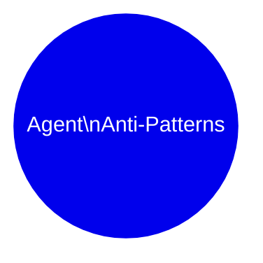

# 🚫 Agent Anti-Patterns Visual Guide

> **Purpose**: A visual reference for LLMs to generate educational slides and infographics about common agent development mistakes.

## 📊 Executive Summary

**Total Failures Analyzed**: 0

| Category | Count | Impact Level |
|----------|-------|--------------|

## 🗺️ Anti-Pattern Landscape

## 🎨 Slide Generation Hints

When generating slides from this document:

1. **Title Slide**: Use the executive summary statistics
2. **Category Slides**: One slide per category with the mindmap subsection
3. **Deep Dive Slides**: Before/After code comparisons with visual metaphors
4. **Impact Slides**: Use frequency bars to show which issues are most common
5. **Takeaway Slide**: Summarize the top 3 anti-patterns to avoid

### Color Coding Reference

| Color | Meaning |
|-------|--------|
| 🔴 Red | Critical issue (>100 occurrences) |
| 🟡 Yellow | Moderate issue (20-100 occurrences) |
| 🟢 Green | Low frequency (<20 occurrences) |
