# 🚫 Agent Anti-Patterns Visual Guide

> **Purpose**: A visual reference for LLMs to generate educational slides and infographics about common agent development mistakes.

## 📊 Executive Summary

**Total Failures Analyzed**: 73

| Category | Count | Impact Level |
|----------|-------|-------------|
| ⚠️ 🔤 String Matching Pitfalls | 39 | 🟡 Moderate |
| 📋 📝 Missing Documentation | 6 | 🟢 Low |
| 🔀 📤 Output Format Mismatch | 3 | 🟢 Low |
| 🔁 🔄 Incomplete ReAct Cycle | 1 | 🟢 Low |

## 🗺️ Anti-Pattern Landscape

```mermaid
mindmap
  root((Agent\nAnti-Patterns))
    🔤 String Matching Pitfalls
      Your 'Available Tools' section...
      The docstring currently reads ...
      The rubric and examples requir...
    📝 Missing Documentation
      your docstring lacks explicit ...
      The tool function needs to be ...
      **Reason:** The prompt is inco...
    📤 Output Format Mismatch
      the generated JSON output does...
      The prompt needs to be impleme...
      **Reason**: Manual JSON struct...
    🔄 Incomplete ReAct Cycle
      The prompt does not explicitly...
```



---

## ⚠️ 🔤 String Matching Pitfalls

> Logic errors where substring matching causes false positives/negatives

### 📈 Frequency Distribution

```
Your "Available Tools" section lists the ██████████████████████████████ (1)
The docstring currently reads `"""****** ██████████████████████████████ (1)
The rubric and examples require the outp ██████████████████████████████ (1)
Your parsing logic contains a severe bug ██████████████████████████████ (1)
While you check if an activity moves ind ██████████████████████████████ (1)
```

### 🃏 Top Anti-Patterns

#### 1. Add Tool Parameter Schemas

**Impact**: 🟢 1 students affected (Criterion 4)

**What went wrong**:
> Your "Available Tools" section lists the *names* and *purposes* of the tools (e.g., "get_activities_by_date_tool: Retrieve valid activities..."), but it does not tell the model what **arguments** (parameters) these tools require.
    *

**Why this breaks the agent**:
> Without knowing that `get_activities_by_date_tool` requires `date` and `city` arguments, the model is flying blind. It might guess correctly sometimes, but often it will hallucinate arguments or fail to provide required ones.
    *

**❌ Anti-Pattern Code**:
```python
## Available Tools
- run_evals_tool(travel_plan: TravelPlan, vacation_info: VacationInfo): Run all evaluation checks.
- get_activities_by_date_tool(date: str, city: str): Retrieve valid activities for a given date (YYYY-MM-DD) and city.
...

```

**✅ Correct Pattern**:
```python
# ✅ CORRECT: Check for negative case first
if "INCOMPAT" in normalized_resp:
    is_compatible = False
elif "COMPAT" in normalized_resp:
    is_compatible = True

# ✅ BETTER: Use exact matching
if normalized_resp == "IS_COMPATIBLE":
    is_compatible = True
elif normalized_resp == "IS_INCOMPATIBLE":
    is_compatible = False
```

**💡 Visual Metaphor**:
> Like a bouncer checking IDs who lets in anyone whose name *contains* 'VIP' - including 'NOT_VIP'!

---

#### 2. Update the Docstring

**Impact**: 🟢 1 students affected (Criterion 3)

**What went wrong**:
> The docstring currently reads `"""********** <--- Fill in the docstring for this function.`
    *

**Why this breaks the agent**:
> Agents rely heavily on docstrings to understand *how* and *when* to use a tool. Without a clear description and parameter details, the agent is essentially guessing, which leads to hallucinations or incorrect tool usage in production.
    *

**❌ Anti-Pattern Code**:
```python
def get_activities_by_date_tool(date: str, city: str) -> List[dict]:
    """
    Retrieves a list of available activities for a given date and city.

    Args:
        date (str): The date to fetch activities for, in 'YYYY-MM-DD' format.
        city (str): The name of the city (e.g., "AgentsVille").

    Returns:
        List[dict]: A list of activity dictionaries.
    """

```

**✅ Correct Pattern**:
```python
# ✅ CORRECT: Check for negative case first
if "INCOMPAT" in normalized_resp:
    is_compatible = False
elif "COMPAT" in normalized_resp:
    is_compatible = True

# ✅ BETTER: Use exact matching
if normalized_resp == "IS_COMPATIBLE":
    is_compatible = True
elif normalized_resp == "IS_INCOMPATIBLE":
    is_compatible = False
```

**💡 Visual Metaphor**:
> Like a bouncer checking IDs who lets in anyone whose name *contains* 'VIP' - including 'NOT_VIP'!

---

#### 3. Fix Output Format Mismatch

**Impact**: 🟢 1 students affected (Criterion 2)

**What went wrong**:
> The rubric and examples require the output format to use `IS_COMPATIBLE` and `IS_INCOMPATIBLE`. Your prompt uses `COMPATIBLE` and `INCOMPATIBLE`.
    *

**Why this breaks the agent**:
> In modular AI systems, downstream components (like parsers) often rely on strict string matching. Deviating from the agreed-upon contract breaks the system.
    *

**❌ Anti-Pattern Code**:
```python
        if "COMPAT" in normalized_resp:
            is_compatible = True
        elif "INCOMPAT" in normalized_resp:
            is_compatible = False
        
```

**✅ Correct Pattern**:
```python
# ✅ CORRECT: Check for negative case first
if "INCOMPAT" in normalized_resp:
    is_compatible = False
elif "COMPAT" in normalized_resp:
    is_compatible = True

# ✅ BETTER: Use exact matching
if normalized_resp == "IS_COMPATIBLE":
    is_compatible = True
elif normalized_resp == "IS_INCOMPATIBLE":
    is_compatible = False
```

**💡 Visual Metaphor**:
> Like a bouncer checking IDs who lets in anyone whose name *contains* 'VIP' - including 'NOT_VIP'!

---

---

## 📋 📝 Missing Documentation

> Tool docstrings lacking critical information for LLM understanding

### 📈 Frequency Distribution

```
your docstring lacks explicit date forma ██████████████████████████████ (1)
The tool function needs to be implemente ██████████████████████████████ (1)
**Reason:** The prompt is incomplete (mi ██████████████████████████████ (1)
**Reason:** The ITINERARY_REVISION_AGENT ██████████████████████████████ (1)
Add explicit Chain-of-Thought guidance l ██████████████████████████████ (1)
```

### 🃏 Top Anti-Patterns

#### 1. your docstring lacks explicit date format specific

**Impact**: 🟢 1 students affected (Criterion 3)

**What went wrong**:
> your docstring lacks explicit date format specification (YYYY-MM-DD), which is crucial for reliable LLM tool usage.

**Why this breaks the agent**:
> Your tool description effectively guides LLM usage with clear purpose definition and proper parameter documentation. The function signature correctly specifies `date: str` and `city: str` types, and your docstring includes detailed Args documentation. The ReAct agent successfully calls this tool wit...

**✅ Correct Pattern**:
```python
# ✅ CORRECT: Comprehensive docstring with format specification
def get_activities_by_date_tool(date: str, city: str) -> List[Activity]:
    """Retrieves available activities for a specific date and city.
    
    Args:
        date (str): Target date in YYYY-MM-DD format (e.g., "2025-06-12")
        city (str): City name (e.g., "AgentsVille")
    
    Returns:
        List[Activity]: Available activities matching criteria
    
    Example:
        >>> get_activities_by_date_tool("2025-06-12", "AgentsVille")
        [Activity(id="A001", name="Museum Tour", ...)]
    """
```

**💡 Visual Metaphor**:
> Like giving someone a map with no labels - they'll guess where to go and probably get lost.

---

#### 2. Failure Reason

**Impact**: 🟢 1 students affected (Criterion 3)

**What went wrong**:
> The tool function needs to be implemented with a complete, well-structured docstring before this criterion can pass

**Why this breaks the agent**:
> The tool function needs to be implemented with a complete, well-structured docstring before this criterion can pass. Don't forget the date format specification - that detail often makes the difference between a tool that works reliably and one that causes frustrating errors.

**✅ Correct Pattern**:
```python
# ✅ CORRECT: Comprehensive docstring with format specification
def get_activities_by_date_tool(date: str, city: str) -> List[Activity]:
    """Retrieves available activities for a specific date and city.
    
    Args:
        date (str): Target date in YYYY-MM-DD format (e.g., "2025-06-12")
        city (str): City name (e.g., "AgentsVille")
    
    Returns:
        List[Activity]: Available activities matching criteria
    
    Example:
        >>> get_activities_by_date_tool("2025-06-12", "AgentsVille")
        [Activity(id="A001", name="Museum Tour", ...)]
    """
```

**💡 Visual Metaphor**:
> Like giving someone a map with no labels - they'll guess where to go and probably get lost.

---

#### 3. Failure Reason

**Impact**: 🟢 1 students affected (Criterion 1)

**What went wrong**:
> **Reason:** The prompt is incomplete (missing Chain-of-Thought guidance) and lacks implementation evidence showing validation against the TravelPlan Pydantic model

**Why this breaks the agent**:
> **Reason:** The prompt is incomplete (missing Chain-of-Thought guidance) and lacks implementation evidence showing validation against the TravelPlan Pydantic model. Please complete your prompt design and submit the full Jupyter notebook with working code.

**✅ Correct Pattern**:
```python
# ✅ CORRECT: Comprehensive docstring with format specification
def get_activities_by_date_tool(date: str, city: str) -> List[Activity]:
    """Retrieves available activities for a specific date and city.
    
    Args:
        date (str): Target date in YYYY-MM-DD format (e.g., "2025-06-12")
        city (str): City name (e.g., "AgentsVille")
    
    Returns:
        List[Activity]: Available activities matching criteria
    
    Example:
        >>> get_activities_by_date_tool("2025-06-12", "AgentsVille")
        [Activity(id="A001", name="Museum Tour", ...)]
    """
```

**💡 Visual Metaphor**:
> Like giving someone a map with no labels - they'll guess where to go and probably get lost.

---

---

## 🔀 📤 Output Format Mismatch

> Response formats that don't match downstream parser expectations

### 📈 Frequency Distribution

```
the generated JSON output doesn't align  ██████████████████████████████ (1)
The prompt needs to be implemented with  ██████████████████████████████ (1)
**Reason**: Manual JSON structure exampl ██████████████████████████████ (1)
```

### 🃏 Top Anti-Patterns

#### 1. the generated JSON output doesn't align with the `

**Impact**: 🟢 1 students affected (Criterion 1)

**What went wrong**:
> the generated JSON output doesn't align with the `TravelPlan` Pydantic model, causing a validation error.

**Why this breaks the agent**:
> Your prompt successfully incorporates role-based prompting and a Chain-of-Thought process. However, the generated JSON output doesn't align with the `TravelPlan` Pydantic model, causing a validation error.

*   **Role Instruction:** Excellent—the agent is clearly instructed to act as a travel planne...

**✅ Correct Pattern**:
```yaml
# ✅ CORRECT: Match the exact expected format from rubric
OUTPUT_FORMAT:
  - Use "IS_COMPATIBLE" (not "COMPATIBLE")
  - Use "IS_INCOMPATIBLE" (not "INCOMPATIBLE")
  
EXAMPLES:
  - Input: "Outdoor hiking" + "Heavy Rain"
    Output: "IS_INCOMPATIBLE: Heavy rain makes trails dangerous"
```

**💡 Visual Metaphor**:
> Like speaking French to a Spanish parser - technically language, but nothing gets through.

---

#### 2. Failure Reason

**Impact**: 🟢 1 students affected (Criterion 2)

**What went wrong**:
> The prompt needs to be implemented with clear role definition, output format specification, and concrete examples before this criterion can pass

**Why this breaks the agent**:
> The prompt needs to be implemented with clear role definition, output format specification, and concrete examples before this criterion can pass. The examples are particularly important for this prompt - don't skip them.

**✅ Correct Pattern**:
```yaml
# ✅ CORRECT: Match the exact expected format from rubric
OUTPUT_FORMAT:
  - Use "IS_COMPATIBLE" (not "COMPATIBLE")
  - Use "IS_INCOMPATIBLE" (not "INCOMPATIBLE")
  
EXAMPLES:
  - Input: "Outdoor hiking" + "Heavy Rain"
    Output: "IS_INCOMPATIBLE: Heavy rain makes trails dangerous"
```

**💡 Visual Metaphor**:
> Like speaking French to a Spanish parser - technically language, but nothing gets through.

---

#### 3. Failure Reason

**Impact**: 🟢 1 students affected (Criterion 5)

**What went wrong**:
> **Reason**: Manual JSON structure examples present instead of Pydantic-generated schema (`TravelPlan

**Why this breaks the agent**:
> **Reason**: Manual JSON structure examples present instead of Pydantic-generated schema (`TravelPlan.model_json_schema()`).  
**Fix**: Replace manual JSON with `{schema_str}` where `schema_str = json.dumps(TravelPlan.model_json_schema(), indent=2)`. See "Next Steps" above for exact code.

**❌ Anti-Pattern Code**:
```python
TRAVELPLAN SCHEMA:
When creating or revising itineraries, ensure the output follows this exact JSON structure:
{{
    "destination": "AgentsVille",
    "start_date": "YYYY-MM-DD",
    ...
}}

```

**✅ Correct Pattern**:
```yaml
# ✅ CORRECT: Match the exact expected format from rubric
OUTPUT_FORMAT:
  - Use "IS_COMPATIBLE" (not "COMPATIBLE")
  - Use "IS_INCOMPATIBLE" (not "INCOMPATIBLE")
  
EXAMPLES:
  - Input: "Outdoor hiking" + "Heavy Rain"
    Output: "IS_INCOMPATIBLE: Heavy rain makes trails dangerous"
```

**💡 Visual Metaphor**:
> Like speaking French to a Spanish parser - technically language, but nothing gets through.

---

---

## 🔁 🔄 Incomplete ReAct Cycle

> Missing THINK-ACT-OBSERVE components in agent prompts

### 📈 Frequency Distribution

```
The prompt does not explicitly state tha ██████████████████████████████ (1)
```

### 🃏 Top Anti-Patterns

#### 1. Failure Reason

**Impact**: 🟢 1 students affected (Criterion 4)

**What went wrong**:
> The prompt does not explicitly state that "run_evals_tool must be run before the final_answer_tool" as required by the rubric

**Why this breaks the agent**:
> The prompt does not explicitly state that "run_evals_tool must be run before the final_answer_tool" as required by the rubric. While your prompt communicates that evaluations must pass, it lacks the explicit sequencing requirement with both function names. Please add a clear statement that uses both

**❌ Anti-Pattern Code**:
```python
"Before you can consider the task to be complete, all tests in the run_evals_tool must have been successful."

```

**✅ Correct Pattern**:
```python
# ✅ CORRECT: Complete ReAct prompt with all components
ITINERARY_REVISION_AGENT_SYSTEM_PROMPT = """
You are an expert travel planner. Follow the THINK-ACT-OBSERVE cycle:

## Available Tools (with parameter schemas)
- get_activities_by_date_tool(date: str, city: str): Get activities
  - date: Date in YYYY-MM-DD format
  - city: City name string
- run_evals_tool(travel_plan: TravelPlan, info: VacationInfo): Validate plan
- final_answer_tool(answer: str): Submit final answer and EXIT

## Workflow
1. THINK: Analyze what needs to be done
2. ACT: Call a tool with proper JSON: {"tool_name": "...", "arguments": {...}}
3. OBSERVE: Review the result
4. Repeat until ready, then call final_answer_tool to EXIT
"""
```

**💡 Visual Metaphor**:
> Like a pilot with only 2 of 3 controls - take-off works, but landing is unpredictable.

---

## 🎨 Slide Generation Hints

When generating slides from this document:

1. **Title Slide**: Use the executive summary statistics
2. **Category Slides**: One slide per category with the mindmap subsection
3. **Deep Dive Slides**: Before/After code comparisons with visual metaphors
4. **Impact Slides**: Use frequency bars to show which issues are most common
5. **Takeaway Slide**: Summarize the top 3 anti-patterns to avoid

### Color Coding Reference

| Color | Meaning |
|-------|--------|
| 🔴 Red | Critical issue (>100 occurrences) |
| 🟡 Yellow | Moderate issue (20-100 occurrences) |
| 🟢 Green | Low frequency (<20 occurrences) |
